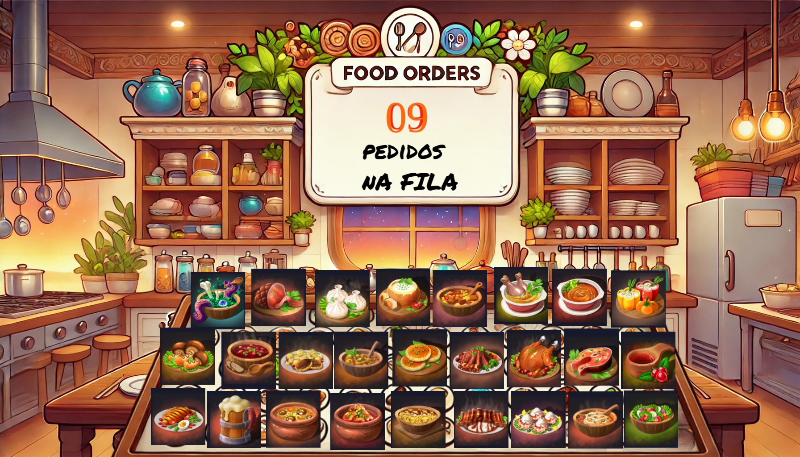

# Restaurant minigame

My goal with this project is to implement messaging with Celery, using Redis as its broker.

It also came in handy that I was learning PHP at the time, so...

# The game
You manage a restaurant and need to process orders, which are piling up, as quickly as possible. 
To complete an order, you will need a bit of (mental) memory to memorize the customer's dish, momentarily, 
and assemble it, relying on your memory to select the customer's choices from among almost a hundred other 
dishes you will have available.

# Prototype
A part of the game would look something near this:
